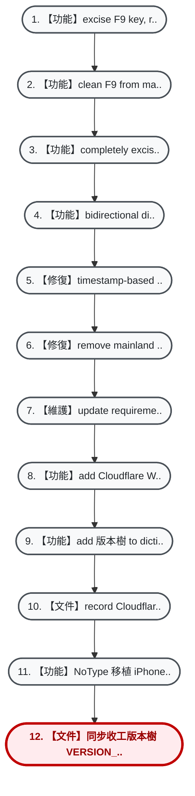

# 🌲 NoType 歷史版本樹 (Project Version Tree)

> **核心定位**：本文件與專案說明書 (`README.md` / `ANTIGRAVITY.md`) 具同等級核心地位。  
> 📌 **當前身處分支**：`main` (HEAD -> `7723cba`)  
> 🚦 **工作區狀態**：⚠️ 有未存檔變更 (Dirty)  
> 🕒 **最後更新時間**：`2026-09-30 19:25:54`

---

### 1. 視覺化分支分岔樹 (Visual Branch Graph)
*註：垂直由上往下演進，主線以 1, 2, 3 編號，分岔以 1-1, 1-2, 1-1-1 階層式編號，清晰大字不擠壓。*



---

### 2. 時光機回溯與存檔對照表 (Time Machine & Commit Log)
*註：點選或複製時光機指令，可隨時一鍵跳轉回任一歷史版本。*

| 編號 (No.) | 存檔ID (Hash) | 提交時間 | 分支/標籤 | 說明 (Commit Message) | 時光機指令 (前往此版本) |
| :---: | :---: | :---: | :---: | :--- | :--- |
| **12** | `7723cba` | 2026-09-28 16:00 |  `HEAD -> main, origin/main, origin/HEAD` | 【文件】同步收工版本樹 VERSION_TREE.md | `git checkout 7723cba` |
| **11** | `58bbc8c` | 2026-09-28 15:57 |  | 【功能】NoType 移植 iPhone 語音輸入方案 B 圓滿收官：Cloudflare Worker 動態中繼、iOS 雙手勢快捷輸入與 SayIt 歷史抽屜落成 | `git checkout 58bbc8c` |
| **10** | `47c4704` | 2026-09-28 13:49 |  | 【文件】record Cloudflare account hjen84@gmail.com | `git checkout 47c4704` |
| **9** | `18e4ca1` | 2026-09-28 13:44 |  | 【功能】add 版本樹 to dictionary 與 corrections | `git checkout 18e4ca1` |
| **8** | `a05b1df` | 2026-09-28 13:44 |  | 【功能】add Cloudflare Worker relay 與 iOS shortcut deployment guide without secrets | `git checkout a05b1df` |
| **7** | `4a3ea27` | 2026-09-28 02:49 |  | 【維護】update requirements.txt | `git checkout 4a3ea27` |
| **6** | `4c9bcd5` | 2026-09-28 02:49 |  | 【修復】remove mainland term 與 update dictionary data | `git checkout 4c9bcd5` |
| **5** | `5661482` | 2026-09-28 02:44 |  | 【修復】timestamp-based sync to fix deleted dictionary words resurrecting | `git checkout 5661482` |
| **4** | `c08b18c` | 2026-09-28 02:28 |  | 【功能】bidirectional dictionary smart merge 與 notebook 自動-start on boot | `git checkout c08b18c` |
| **3** | `0839abd` | 2026-09-27 21:11 |  | 【功能】completely excise Shift+F8, promote Ctrl+~ as sole unconflicted hotkey 針對 quick learn | `git checkout 0839abd` |
| **2** | `1ebb0ec` | 2026-09-27 20:57 |  | 【功能】clean F9 from main.py startup banner 與 reorder hotkeys | `git checkout 1ebb0ec` |
| **1** | `672623f` | 2026-09-27 20:56 |  | 【功能】excise F9 key, reorder hotkeys 1:Alt/~, 2:Shift+F8/Ctrl+~, 3:F8/Alt+~ , 與 implement window geometry memory 針對 history, dictionary, help, 與 quick learn | `git checkout 672623f` |
| **-** | `3c88006` | 2026-09-27 18:53 |  | 【修復】enlarge dictionary manager 與 help guide, enable mouse resizing 搭配 scrollable canvas | `git checkout 3c88006` |
| **-** | `6f817fc` | 2026-09-27 18:47 |  | 【修復】enlarge quick learn 與 history panel dimensions 與 font scaling 針對 laptops | `git checkout 6f817fc` |
| **-** | `25b4a7e` | 2026-09-27 18:35 |  | 【修復】make Ctrl+~ open quick learn even without text selection, 與 add fallback modifier checks | `git checkout 25b4a7e` |
| **-** | `0bf9733` | 2026-09-27 18:11 |  | 【功能】add Ctrl+~ 針對 quick learn 與 Alt+~ 針對 rephrase laptop Fn-free 支援 | `git checkout 0bf9733` |
| **-** | `3489095` | 2026-09-27 17:45 |  | 【修復】強制實施 strict CRLF 與 100% pure ASCII 針對 UPDATE_NOTEBOOK.bat 與 start_admin.bat to prevent CMD CP950 buffer corruption | `git checkout 3489095` |
| **-** | `20f5c4d` | 2026-09-27 17:39 |  | 【修復】支援 dropbox_path.txt 動態 resolution 與 interactive directory fallback in UPDATE_NOTEBOOK.bat | `git checkout 20f5c4d` |
| **-** | `21816a1` | 2026-09-27 17:22 |  | 【修復】lower silence threshold to 0.0005, add stop_recording toast reasons, enable 自動-diagnostics to Dropbox, 與 動態 python discovery | `git checkout 21816a1` |
| **-** | `512353f` | 2026-09-27 17:05 |  | 【修復】ensure UPDATE_NOTEBOOK.bat copies all python scripts to prevent omitting groq_api.py on notebook | `git checkout 512353f` |
| **-** | `da39233` | 2026-09-27 16:55 |  | 【功能】implement true MCI audio pause/resume toggle orange pause 與 dedicated stop/reset button red stop | `git checkout da39233` |
| **-** | `54d1c25` | 2026-09-27 16:47 |  | 【重構】eliminate 冗餘 dedicated stop button from history cards, embracing single 動態 play-stop toggle | `git checkout 54d1c25` |
| **-** | `d7ba30b` | 2026-09-27 16:38 |  | 【修復】remove failing sync-skills workflow, fix edit button width in ui_manager, 與 configure low reasoning effort 搭配 500 max_tokens 針對 gpt-oss models in groq_api | `git checkout d7ba30b` |
| **-** | `85c592f` | 2026-09-27 16:17 |  | 【功能】upgrade history card buttons to colored semantic badges 搭配 Chinese labels | `git checkout 85c592f` |
| **-** | `a12723c` | 2026-09-27 16:06 |  | 【功能】add immediate stop audio button 與 toggle state to history cards | `git checkout a12723c` |

---

### 3. 現存分支架構 (Active Branches)
- 🌿 `main` **(HEAD 當前所在)**

---

### 4. 終端完整拓撲圖 (Terminal ASCII Graph)
```text
* 7723cba (HEAD -> main, origin/main, origin/HEAD) 【文件】同步收工版本樹 VERSION_TREE.md
* 58bbc8c 【功能】NoType 移植 iPhone 語音輸入方案 B 圓滿收官：Cloudflare Worker 動態中繼、iOS 雙手勢快捷輸入與 SayIt 歷史抽屜落成
* 47c4704 docs: record Cloudflare account hjen84@gmail.com
* 18e4ca1 feat(dict): add 版本樹 to dictionary and corrections
* a05b1df feat(ios): add Cloudflare Worker relay and iOS shortcut deployment guide without secrets
* 4a3ea27 chore: update requirements.txt
* 4c9bcd5 fix(dict): remove mainland term and update dictionary data
* 5661482 fix(sync): timestamp-based sync to fix deleted dictionary words resurrecting
* c08b18c feat(sync): bidirectional dictionary smart merge and notebook auto-start on boot
* 0839abd feat: completely excise Shift+F8, promote Ctrl+~ as sole unconflicted hotkey for quick learn
* 1ebb0ec feat: clean F9 from main.py startup banner and reorder hotkeys
* 672623f feat: excise F9 key, reorder hotkeys (1:Alt/~, 2:Shift+F8/Ctrl+~, 3:F8/Alt+~), and implement window geometry memory for history, dictionary, help, and quick learn
* 3c88006 fix(ui): enlarge dictionary manager and help guide, enable mouse resizing with scrollable canvas
* 6f817fc fix(ui): enlarge quick learn and history panel dimensions and font scaling for laptops
* 25b4a7e fix: make Ctrl+~ open quick learn even without text selection, and add fallback modifier checks
* 0bf9733 feat: add Ctrl+~ for quick learn and Alt+~ for rephrase (laptop Fn-free support)
* 3489095 fix(bat): enforce strict CRLF and 100% pure ASCII for UPDATE_NOTEBOOK.bat and start_admin.bat to prevent CMD CP950 buffer corruption
* 20f5c4d fix(backup): support dropbox_path.txt dynamic resolution and interactive directory fallback in UPDATE_NOTEBOOK.bat
* 21816a1 fix(notebook): lower silence threshold to 0.0005, add stop_recording toast reasons, enable auto-diagnostics to Dropbox, and dynamic python discovery
* 512353f fix(deploy): ensure UPDATE_NOTEBOOK.bat copies all python scripts to prevent omitting groq_api.py on notebook
* da39233 feat(ui): implement true MCI audio pause/resume toggle (orange pause) and dedicated stop/reset button (red stop)
* 54d1c25 refactor(ui): eliminate redundant dedicated stop button from history cards, embracing single dynamic play-stop toggle
* d7ba30b fix: remove failing sync-skills workflow, fix edit button width in ui_manager, and configure low reasoning effort with 500 max_tokens for gpt-oss models in groq_api
* 85c592f feat(ui): upgrade history card buttons to colored semantic badges with Chinese labels
* a12723c feat(ui): add immediate stop audio button and toggle state to history cards
```

---
*💡 由全域工具 `git_version_tree.py` 自動生成與維護，每次收工自動同步更新。*
